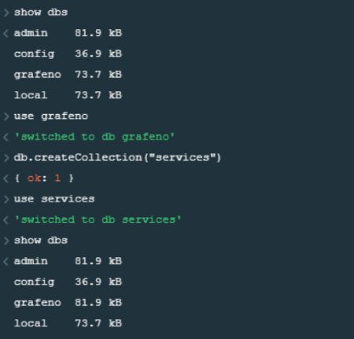
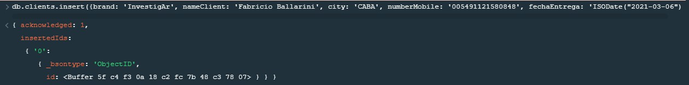
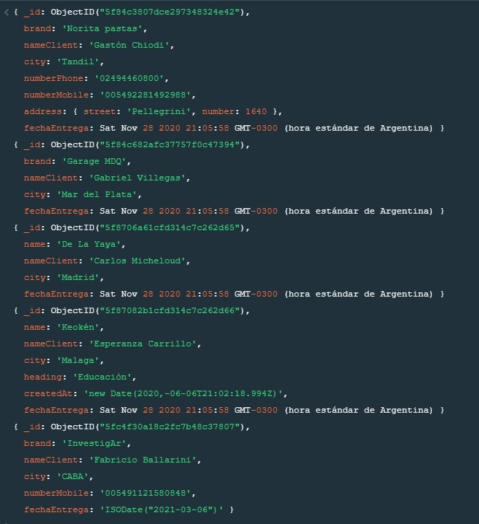
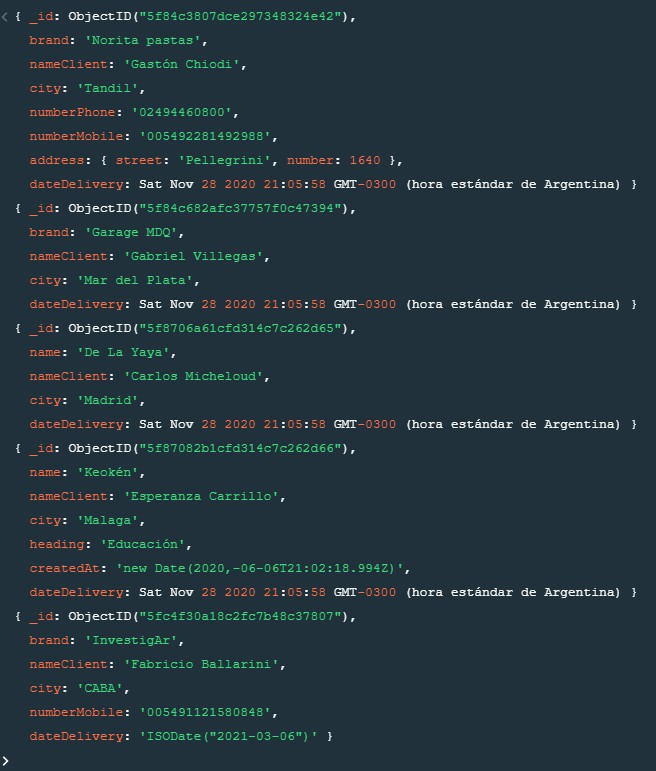
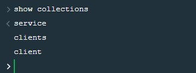
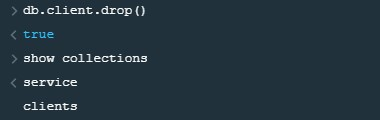
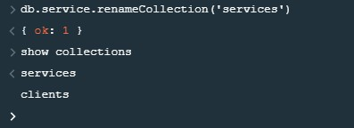

## Seminario MongoDB - TUDAI - FCE - UNICEN / 2020

### Actividad 1
**1.** Instalar MongoDB en ambiente local.

**2.** Conectarse a MongoDB vía CLI.

**3.** Crear una nueva base de datos llamada futbolfifa.

**4.** Crear una nueva collection llamada players.

**5.** Insertar 5 documentos en la collection players con datos básicos (nombre, apellido, posición, fecha de nacimiento, etc).

**6.** Listar todos los documentos de la collection players.

**7.** Crear otras collections con documentos (ej. teams, games, etc).

Importante: Guardar cada comando y subirlo a un repo/gist en GitHub.

### COMANDOS

> #### Start MongoDB 
> - ***mongod***
>
> #### Connect to MongoDB using CLI 
> - ***mongo***
>
> #### Help command 
> - ***help***
>
> #### Show databases 
> - ***show dbs***
>
> #### Connect or create a database 
> - ***use <dbname>***
>
> #### Create new collection 
> - ***db.createCollection(“countries”)***

**1.**  Se creó la db para la empresa ***grafeno***.

**2.**  Dentro de esta se crearon las colecciones ***service***, ***clients*** y ***client***.

**3.**  Se posiciona en collección ***service***

**4.**  Se inserta un documento con el siguiente comando: 

***db.clients.insert({brand: 'InvestigAr', nameClient: 'Fabricio Ballarini', city: 'CABA', numberMobile: '005491121580848', fechaEntrega: 'ISODate("2021-03-06")'})***

**5.**  Después de cargar más documentos sin campo fechaEntrega se usó este comando para agregar dicho campo al resto de los documentos.  

***db.clients.insert({brand: 'InvestigAr', nameClient: 'Fabricio Ballarini', city: 'CABA', numberMobile: '005491121580848', fechaEntrega: 'ISODate("2021-03-06")'})***

**6.**  Se editó el nombre del campo ***fechaEntrega*** por ***dateDelivery***.

***db.clients.updateMany( {}, { $rename: { "fechaEntrega": "dateDelivery" } } )***

**7.**  Se muestran todas las colecciones de la db ***grafeno*** con el siguiente comando:

**8.**  Se eliminó la colección ***client*** con el siguiente comando:

**9.**  Se editó el nombre de la colección ***service*** por 

***services*** para mantener consistencia y todas las colecciones sean en plural.

***db.service.renameCollection('services')***

### Actividad 2

**1.** Crear una nueva base de datos de un sistema de streaming de video
(ej. Netflix, Flow, Amazon Prime) que permita almacenar movies.

**2.** Para cada movie, se debería guardar información como título
(String), year (Number), rating (Number, entre 1.0 y 5.0), genre
(String), description (String), actors (Array<String>), country
(String), income (Number), duration (Number).

**3.** Agregar películas usando insert(), insertOne() & insertMany().

**4.** Actualizar películas agregando el field highlighted=true a aquellas
con rating > 4.5.

Importante: Guardar cada comando y subirlo a un repo/gist en GitHub.

**5.** Actualizar películas cambiando el genre “drama” por “bored”.

**6.** Borrar todas las películas que tengan más de 30 años.

**7.** Buscar todas las películas argentinas.

**8.** Buscar todas las películas de acción con un buen rating (ej. > 4.0)
que hayan salido los últimos 2 años.

### COMANDOS

> ***use stv*** 
> - Crea una nueva base de datos llamada ***stv*** (Streaming Video).

> ***db.createCollection("netflix")***
> - Crea una nueva colección llamada ***netflix***.

> ***use netflix***
> - Se posiciona sobre la colección llamada ***netflix***

> ***db.createCollection("movies")***
> - Crea una nueva colección llamada ***movies***.

> ***db.movies.insert(***
***{ title: 'Titanic',*** 
    ***year: 1998,*** 
    ***rating: 4.7, ***
    ***genre: 'Romance',*** 
    ***des195cription: 'Una joven de la alta sociedad abandona a su arrogante pretendiente por un artista humilde en el trasatlántico que se hundió durante su viaje inaugural.',*** 
    ***country: 'EEUU',*** 
    ***income:  2.,***
    ***duration: 240 } )***
> - Crea un documento en la colección ***movies***

> ***db.movies.update({title: 'Titanic'}, {$push: {actors: {$each:['Leonardo Dicaprio', 'Kate Winslet', 'Billy Zane']}}})***
> - Inserta un arreglo en la película con ***title*** 'Titanic'.

> ***db.movies.insertOne({title: 'Guasón', year: 2019, rating: 4.5, genre: 'Crimen', description: 'Arthur Fleck adora hacer reír a la gente, pero su carrera como comediante es un fracaso. El repudio social, la marginación y una serie de trágicos acontecimientos lo conducen por el sendero de la locura y, finalmente, cae en el mundo del crimen.', country: 'EEUU', income:  1.074, duration: 140})***
> - Crea un documento en la colección ***movies***

